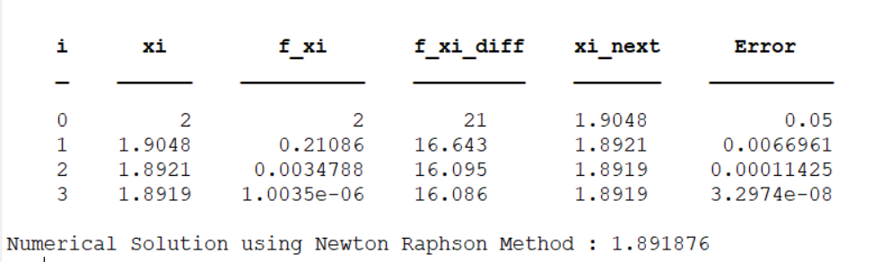
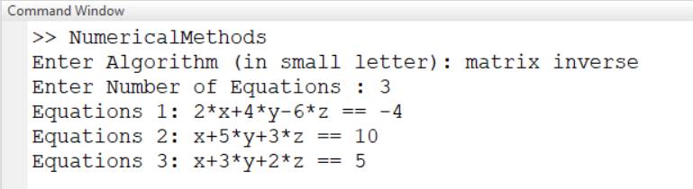
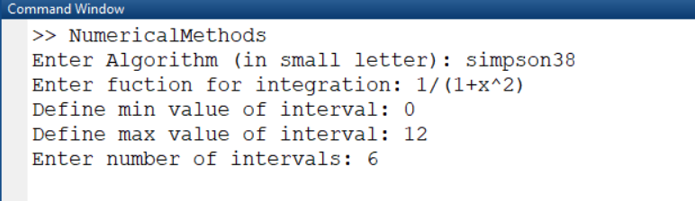
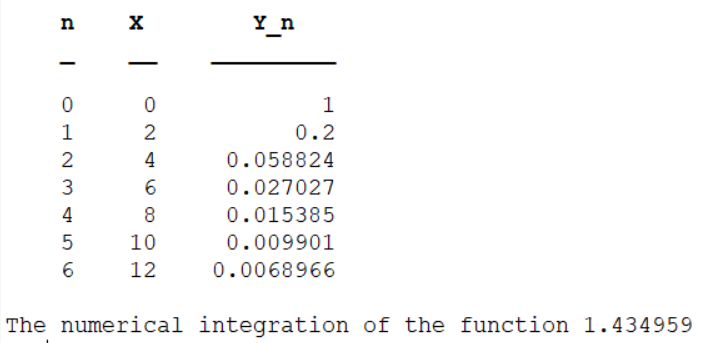
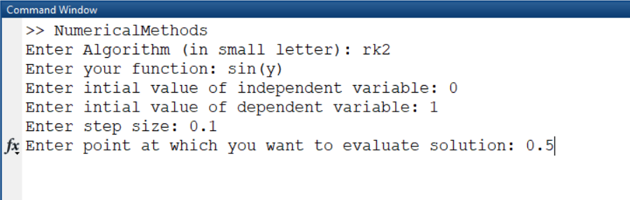
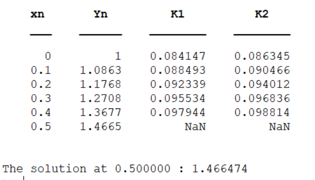

# NumericalMethods
This repository contains naive implementation of different numerical methods applied in linear algebraic equations, integration, ordinary differential equations etc. The following methods are implemented.

**For the Numerical Solution of Algebraic Aquations**
1. The Bisection Method
2. The False Position Method
3. The Newton Raphson Method
4. The Secant Method

**For the Numeric Solution of Linear System of Equations**
1. Matrix Inversion Method
2. Gauss Elimination Method
3. Gauss Jordan Method
4. Gauss Seidal Method

**For Numerical Integration**
1. Trapezoidal Rule
2. Simpson 1/3 formula
3. Simpson 3/8 formula

**To Find the Solution of Ordinary Differential Equations**
1. Euler's Method
2. Picard's Method
3. Runge-Kutta Method of Order 2
4. Runge-Kutta Method of Order 4

**For Function Approximation**
1. Taylor Series Expansion

## Installation Step
1. Step-1: Download or clone this repository.
2. Step-2: Open MATLAB and change working directory to the downloaded directory
3. Step-3: Run NumericalMethods.m

## Usage Examples
Run the **NumericalMethods.m** file and when prompted write the method name to use in small letter. To be specific the method name to write for each numerical technique is given in the table.

| Method            | write               | Method            | write               |
| -------------     |:-------------:      | -------------     |:-------------:      |
| Bisection         | 'bisection'         |Trapezoidal Method | 'trapezoidal'       |
| False Position    | 'false position'    |Simpson 1/3 Method | 'simpson13'         |
| Newton Raphson    | 'newton raphson'    |Simpson 3/8 Method | 'simpson38'         |
| Secant            | 'secant'            |Picard's Method    | 'picard'            |
| Matrix Inversion  | 'matrix inverse'    |Euler's Method     | 'euler'             |
| Gauss Elimination | 'gauss elimination' |Runge Kutta Methd of order 2 | 'rk2'     |
| Gauss Jordan      | 'gauss jordan'      |Runge Kutta Method of order 4 | 'rk4'    |
|Gauss Seidal       | 'gauss seidal'      |Taylor Series Method          | 'taylor series' |

### Newton Raphson Method
for example, to find the real root of    near 2.0  using the **Newton Raphson method**, write newton raphson first to select it. and choose the value of necessary parameters prompted to find the solution as shown.

The final output consists of an iteration table and the solution value. 

### Matrix Inversion Method
To find the solution of a linear system of equations using **Matrix Inverse** method, E.g for the following equations,

similarly first write 'matrix inverse' and provide paramteres value such as number of equations, equations etc. and obtain the output for each variable.

### Simpson 3/8 Rule
To find the numerical integration of a function        using Simpsion 3/8 formula, write simpson38 when prompted to choose algorithm and provide required values

### Runge-Kutta Method or Order Two
The following images are the procedure to find the solution of an ordinary differential equation        using Runge-Kutta method.

